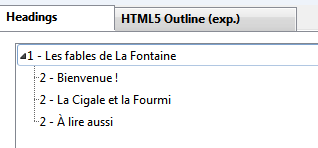

#Site «&nbsp;La Fontaine&nbsp;» (Pages Web liées avec images et page d'accueil)

##Énoncé

Partant de l'énoncé *Site «&nbsp;La Fontaine&nbsp;» (Pages Web liées avec images)*, y ajouter une page d'accueil qui permet de lister et d'accèder aux différentes pages (fables) du site.
Prévoir également un lien de retour à l'accueil dans les pages affichant les fables.

##Balises à utiliser (dans le body)

- a
- blockquote
- br
- cite (avec classe "author" ou "work" pour désigner respectivement l'auteur ou l'ouvrage)
- footer
- h1
- h2
- header
- hr
- img
- li
- nav
- p
- q
- section
- ul

Consulter le livre de référence pour toutes informations utiles

##Résultats attendus

Voici des captures d’écrans d’un exemple de réalisation :

---

Le plan de votre page doit correspondre au résultat suivant :

Les pages doivent bien entendu être valides.

Bon Travail !